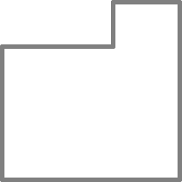

Puzzle 3
=========

El Tortugo abrío su cuadernillo en el tercer puzzle y lo miró por un rato. 

"Quizás," dijo, "ayudaría si consideraras a ésta figura como un rectángulo al que le han arrancado una esquina."

"¿Cómo puede eso ayudar?" dije, mientras me acomodaba en frente de la computadora. 

"Bien, por lo menos te permitiría saber a qué me refería cuando dije '¿Cuál esquina tiene un mordisco arrancado?', o si dijera 'Vean si pueden dibujar esta figura con el mordisco arrancado de otra esquina,' o si dijera '¿Pueden dibujar esta figura con un mordisco rectangular, o un mordisco cuadrado, o más de un mordisco,' o....."

"Entiendo el punto," dije. "Pongámonos a trabajar en eso."

"En serio, EBN, eres difícil a veces; realmente necesitamos considerar todas las posibilidades." El Tortugo reasumió su compostura y miró el puzzle otra vez. 

"Sabes," dijo, "Algunos de estos puzzles pueden ser resueltos de manera muy ordenada, y otros no."

"¿Oh?" dije. "¿Qué quieres decir con 'ordenada'?"

"Bien, puedes a veces encontrar una manera muy simple de escribir los comandos. A veces hay un patrón en los comandos, a veces puedes encontrar una manera para usar menos comandos... Depende del puzzle. A veces, no hay una solución ordenada, pero puedes aprender algo mientras la buscas. "

"Entiendo el punto," dije. 

"Por cierto, casi lo olvido," dijo el Tortugo. "¿Cómo se llaman las huellas que deja la tortuga Logo?"

Pensé la cuestión por un momento. "No lo sé," dije, "¿Cómo se llaman?"

"El patrón de patas ordenadas."

