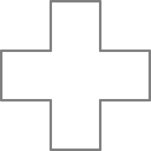

Figura 5
========

El Tortugo miró el cuadernillo abierto sobre el escritorio del estudio. "¿Cómo vas progresando?" preguntó. 

"Difícilmente lo llamaría progreso," dije, sin levantar la mirada. 

"¿Puedo ayudar?" preguntó. Parecía responder muy bien a las admisiones de derrota. "¿Cuál es el problema?"

"Bien," dije, "Calculé una serie de comandos para dibujar la cruz, pero no eran muy satisfactorios; muchos comandos...hileras enteras de comandos."

"No hay nada de malo en eso," dijo el Tortugo, "Es una solución perfectamente aceptable."

"Sí, eso supongo," dije, "sí funcionó. Pero estuve pensando en lo que dijiste el otro día... Ya sabes, acerca de buscar soluciones simples. No puedo encontrar ninguna." 

"Déjame hacer dos comentarios," dijo el Tortugo. Sonaba verdaderamente paternal. "Primero, no **tienes** que encontrar soluciones ordenadas; cualquier comando que funcione es un resultado útil. Segundo, si realmente quieres encontrar una solución simple, considera el siguiente acertijo:

    **¿Qué tiene esta figura en común con:**

    **Una barca, pero no una goleta?**

    **Un bife con verduras, pero no una lata de arvejas?**

    ***Las Cuatro Estaciones*, pero no *Submarino Amarillo*?**

    **Un nudo marinero, pero no un turbante?"**

El Tortugo hizo una pausa para respirar y luego dió un paso atrás alarmado. 

"¿Porqué me estás mirando así?" dijo. 

"No creo que quieras saber," dije. 
 
