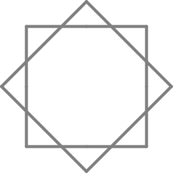

Figura 7
========

El Tortugo, en una de sus periódicas fases detectivescas, estaba releyendo *Las Aventuras de Sherlock Holmes.* Yo estaba comenzando con la figura 7, pero tenía la mente en blanco. 

Luego de un rato dije: "¿Qué tal un acertijo para ayudarme a resolver esta figura?"

El Tortugo dejó su libro sobre la mesa y consideró mi pedido por un momento. "No." dijo. "Éste es demasiado fácil. Especialmente luego de que resolviste la figura 6 tan elegantemente."

"Bien, esa fue la figura que me convenció de que vale la pena tener los acertijos... No puedo decir lo mismo de la poesía, o como sea que lo llames, que usas para expresarlos."

"Te diré lo que haré," dijo el Tortugo, ignorando mi cumplido, "Te daré una pista para una figura mas difícil que está relacionada con ésta."  

"¿Qué es un **pista**? dije. 

"Una pista es un acertijo que tiene un solo número como solución; el número representa una secuencia numérica de otra figura en el cuadernillo. En algunos casos la figura con la que lo relaciona será una figura más difícil, en otros casos, más fácil." 

"Está bastante claro", dije aprensivamente. 

El Tortugo hizo una pausa un momento. "¿Cómo es ésto?" dijo. 

    **"Si se explotan suficientes dispositivos de uranio,**

    **Nuestro planeta se volverá de alguna manera apasionante,**

    **Terminaremos teniendo hierbas y condimentos brillantes,**

    **Y huesos que dan un brillo interno."**

Yo estaba desconcertado. 

"Elemental, mi querido EBN," dijo el Tortugo levantando su libro. 

