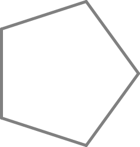

**FIGURA 10**
=============

El Tortugo entró a la cocina con el cuadernillo en la mano. "Sabes EBN," dijo con entusiasmo, "las siguientes tres figuras, 10, 11 y 12, cuentan parte de una historia muy interesante. La historia escondida es más importante que los propios acertijos de muchas maneras." 

"A contar a otro lado," dije mientras rompía otro huevo en la sartén. 

"Bien," dijo el Tortugo. "Creo que deberías jugar un poco con la historia. Tú sabes, otra chance de aprendizaje por descubrimiento."

"¡Oh, no!" dije, "no más aprendizaje por descubrimiento."

"A veces es un buen enfoque," dijo el Tortugo firmemente, "y éste es uno de esos. No te daré pistas para las figuras. Estoy seguro de que puedes resolverlos por tí mismo a ésta altura, pero te daré pistas para la historia escondida. Es una historia de geometría."

"Está bien, lo intentaré," dije. "Debo admitir que me gustó el asunto del triángulo. Una vez que superé el shock inicial. Empiezo a ver que soy bastante bueno con éste asunto de la tortuga y la geometría."

"Bien," dijo el Tortugo mientras se sentaba a demoler su desayuno habitual de seis huevos. Miró el plato por un momento y luego dijo, "En realidad, hay seis figuras que son parte de la historia escondida. Aquí va una pista para ayudarte a encontrar dos más:

.. line-block::

    **'No te hagas el vivo,' dijo el Tortugo, 'es muy temprano,**
    **Aún tienes que resolver de manera cíclica esta figura,**
    **Que relaciona otras dos figuras a la figura del pentágono,**
    **Tal como el neón esta integrado por flúor e hidrógeno.'**

"Suena a mucho aire caliente para mí," dije, poniéndole un poco más de salsa a mis huevos. 

  
