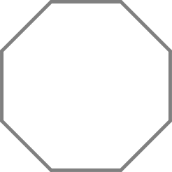

**FIGURA 12**
=============

El Tortugo y yo estábamos en el laboratorio cuando él levantó la vista y dijo, "Por cierto, ¿Cómo vas con las figuras Logo?"

"Nada mal," dije, "Estoy en la figura 12."

"Ah, sí," dijo el Tortugo sonriendo, "es la tercera de la figuras que están relacionadas. Por lo menos, es la tercera de las que te dije que están relacionadas. Cuando resuelvas la manera de decirle a la tortuga que dibuje un octógono, quizás quieras volver a pensar en la historia escondida."

"No estoy progresando mucho. A veces parece como si me fuese a tomar siglos entender toda ésta cuestión," dije. 

"Sí. Supongo que sería mejor que te diera un puntero para la sexta figura," dijo el Tortugo mientras tomaba la lupa y se inclinaba para examinar una pila de polvo negro que había puesto en un crisol. Hizo una pausa y luego dijo: "Harías bien en recordar, si quieres estar seguro de ganarte el pan, que siempre debes ser objetivo y pestarle atención a los hechos observables."

"Eso es todo?" pregunté. 

El Tortugo levantó la lupa y me miró de manera monstruosa. "Sí," dijo.   
