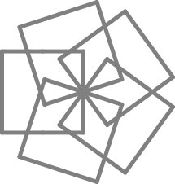

FIGURA 20
=========

"Deberías tratar de llegar a alguna conclusión general sobre los patrones cuando termines con ésta figura," dijo el Tortugo. Dejó de lado su clásico encuadernado en cuero y se fue a tostar panecillos al fuego. Yo trataba de escribir un procedimiento viable para la figura 20. 

"Ahá," dije. 

"Éstas figuras están diseñadas para construir tu entendimiento sobre patrones... Los patrones son la base de las matemáticas, de la ciencia, incluso de la vida..."

"El Universo, y todo," dije. 

"Bien. Sí. Algo así."

"Douglas Adams te hubiera amado," dije. 

"¿Quién?" dijo el Tortugo. 

"Cambiemos de tema," dije, "¿Qué tal un acertijo que me dé una pista de tus profundos pensamientos?" 

El Tortugo se recostó en su silla y acercó los dedos de sus pies al fuego. "A veces," dijo, "No estoy seguro de si entiendes lo que te digo."

"Me estás subestimando," dije. 

"Necesitas pies ágiles," dijo el Tortugo, preparando la tarea, "Necesitas reconocer que el argumento puede darse vuelta en éste punto, o en aquél, o en ninguno, o que..."

"El resultado es generalmente el mismo," dije, "Una Confusión de Tortuga." 

