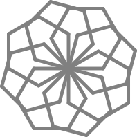

**FIGURA 22**
=============

"He estado por preguntarte algo," le dije al Tortugo cuando entró al estudio. "¿Porqué hay tantas figuras en el cuadernillo?" 

"¿Porqué tantos?" dijo el Tortugo. "Porque quise darle una oportunidad a todos de descubrir cosas sobre las matemáticas de los patrones... Y eso requiere de muchas figuras." 

"Pero muchas de ellas se parecen mucho," dije. 

"¡Ahá! ¡Ese es exactamente el punto! ¡Has comenzado a hacer descubrimientos!" 

"¿Qué quieres decir?"

"Bueno, has visto los patrones y has notado que algunos de ellos se parecen. Pero no pudiste hacerlo sin que **hubieran** unas figuras que se parecieran, ¿verdad? Ahora, déjame preguntarte algo... Algunos patrones se parecen, pero son **exactamente** iguales?" 

"No," dije, "Tienen algunas características en común, pero también hay diferencias." 

"¡Exacto!" dijo el Tortugo. "¿No es verdad que no podrías encontrar el significado de 'igual' si no tuvieras figuras del mismo tipo **y** figuras de diferentes tipos?" 

"Entiendo lo que quieres decir," dije, "Entonces necesitas unas cuantas figuras para mostrar varios patrones de diferentes tipos, especialmente cuando cada tipo debe ser mostrado más de una vez."

"¡*Correct*!" dijo el Tortugo. "Oh, mientras tú piensas en ésas cuestiones, quería darte una pista para una figura que está relacionada con la Figura 22."

El Tortugo me dió una hoja de papel:

    **Conocí a Liz un día en Noviembre pasado,**

    **Su silueta no he olvidado,**

    **Sus medidas tienden a crecer,**

    **De la cabeza a los pies,**

    **A la clase de las pirámides se ha integrado.**

    **Canciones con ritmo a Liz le encanta cantar,**

    **Sorprendentemente limpio es su articular,**

    **Pero de una cuarta es su rango,**

    **Su timbre es algo extraño,**

    **Y de sus pies las notas parecen sonar.**

 
