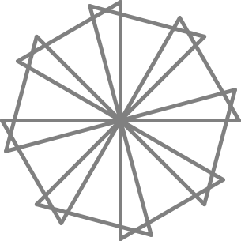

FIGURA 23
=========

El Tortugo y yo estábamos sentados al lado del estanque. De vez en cuando el Tortugo tiraba una piedra al agua. Mirábamos los patrones que las ondas formaban. 

"Sabes," dijo el Tortugo, "Esos patrones me hacen acordar a algunos de los problemas de Logo que has estado resolviendo."

"Pensé que no necesitabas que te hagan acordar," dije. "En realidad, me hacen acordar que tengo que conseguir aspirinas la próxima vez que vaya de compras."

"Eso es extraordinario," dijo el Tortugo, "¿Porqué te hicieron acordar a las aspirinas?"

"Seguro que hay peces con dolores de cabeza en ese estanque," dije. 

El Tortugo se rió entre dientes, y luego dijo, "Mientras pasas por éstas últimas figuras ¿Piensas detenerte a pensar en las soluciones, y en lo que has aprendido sobre describir patrones?"

"Sí," dije, "aunque a veces pienso que tus pistas son bastante enigmáticas."

"Entiendo lo que quieres decir," dijo el Tortugo, "pero estoy tratando de encontrar el balance entre dar demasiada ayuda, y por ende no dar lugar al descubrimiento, y no dar suficiente ayuda."

"Oh, creo que lo has logrado en gerenal," dije, "quiero decir, no dar suficiente ayuda." 

El Tortugo se acostó en la manta de picnic, con las manos detrás de su cabeza, mirando hacia arriba entre las hojas. Luego de un rato, se sentó. 

"¿Porqué?" dijo, mirándome por arriba del marco de sus anteojos. "¿No puedes encajar una estaca cuadrada en un agujero redondo?"

"Porque las esquinas quedan afuera," dije. 

"Pero seguramente si la estaca es suficientemente chica, encajará."

"¡Entiendo!" dije, entusiasmándome, "Y una estaca redonda no encajará si es demasiado grande!....

Oh, ¡Formaciones de mosaicos!... ¡Empiezo a hablar como una tortuga!"  

"Un estudiante aceptable," dijo el Tortugo. 

