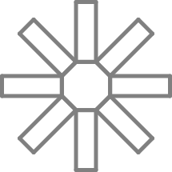

Figura 25
=========

El Tortugo miraba por encima de mi hombro mientras yo seguia luchando en la Figura 25. Probé unos comandos al azar, y él miraba sin decir nada; aunque sí estaba un poco inquieto... Bien, en realidad... Estaba bastante nervioso para alguien que cree en el aprendizaje explotatorio. 

"¿Quieres que te lo traduzca?" dijo después de un rato. 

"No, gracias," dije, "Quiero hacerlo solo. Además, entiendo completamente tu lenguaje extremadamente simple."

El Tortugo se dió vuelta, un poco abruptamente me pareció, y caminó hacia la puerta. 

"¿Dónde vas?" le pregunté. 

"A unirme al Movimiento de Rehabilitación de Tortugas Desplazadas," dijo sobre su hombro. 

"Vuelve aquí," dije con firmeza, "Lo lamento si te ofendí." 

El Tortugo se detuvo y volvió lentamente. "Está bien," dijo. 

"Supongo que estoy susceptible porque estoy confundido," dije, "Una cosa es resolver las figuras y otra cosa es pensar en la organización de los patrones."

"¿Quieres que te ayude?" dijo el Tortugo.

"Sí," dije, "siempre y cuando tus honorarios sean razonables."

"Bien, piensa en la Figura 25 y la Figura 8," dijo el Tortugo, "¿Cómo son iguales, cómo diferentes?"

"¿Eso es ayuda?" dije. 

"Sí," dijo el Tortugo, "Eso es ayuda. Tómala o déjala. ¡Sin cargo!" 

