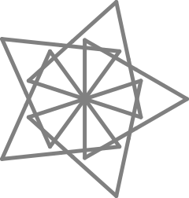

**FIGURA 26**
=============

"Dime algo más de los acertijos," le dije al Tortugo mientras flotábamos en la piscina en nuestras colchonetas. 

"¿Qué quieres decir?" dijo el Tortugo, "¿Quieres que te dé las soluciones?"

"No, por supuesto que no," dije. "Quiero decir, dime el tipo de información que se esconde en los acertijos."

"Bien," dijo el Tortugo, chapoteando su colchoneta más cerca mío, "Hay básicamente tres tipos de acertijos - el primer tipo te dá ideas sobre cómo resolver las figuras, el segundo tipo te dá pistas sobre las propiedades de los patrones y el tercer tipo te dá pistas para otras figuras que están relacionadas con la que estás resolviendo."

"¿Qué quieres decir con 'relacionadas'?"

"Significa que algunas disposiciones de comandos Logo aparecerán en las soluciones de las dos figuras," dijo el Tortugo. 

"Me parece bien," dije. "¿Me dirías siempre qué tipo de información está escondida en el acertijo?"

"Te he señalado pistas hasta ahora," dijo el Tortugo contemplativamente, "pero podría cambiar eso... Es más **voy** a cambiarlo; no te voy a dar tal información de ahora en más."

"¡Narices!" dije con sentimiento, "Debí haberme quedado callado."

"Siempre recomendable en una piscina," dijo el Tortugo, soltando una risa. 

"Aquí tienes tu siguiente acertijo:

.. line-block::

    **Dijo Bill Constante en su ronda,**
    **'Es un placer el crimen interpretar,**
    **Siempre y cuando puedas entender,**
    **Que las ideas que crecen,**
    **Como motivo y método competir deben.'...** 

"Criminal," dije. 

