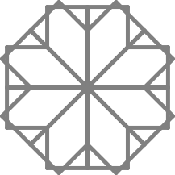

Figura 28
=========

"Sabes, EBN," dijo el Tortugo, "pareces estar pasando por alto que todas la figuras desde la Figura 16 a la 40 tienen por lo menos una propiedad en común."

"¿Que a todas las dibujaste tú?"

"Dos propiedades en común."

"¿Que todas son difíciles de resolver?"

"Tres propiedades en común."

"¿Que todas vienen con acertijos?"

"Cuatro propiedades en común."

"¿Que todas..."

"¡EBN! Sabes que me refiero a una propiedad geométrica en común."

"Justo lo que estaba por decir cuando me interrumpiste," dije inocentemente, "pero gracias por la pista."

El Tortugo me tiró una mirada fulminante; luego, sin una palabra, me alcanzó una hoja de papel y se fué ofendido. 

Miré el papel: 

.. line-block::

    **Thalia disfruta de un buen ataque de risa,**
    **Y la poesía está primera en su lista,**
    **Pero dale una actuación en una adivinanza,**
    **Y a ninguna perderá de vista.**

"Gracias por las pistas adicionales," le dije mirando hacia el hall. 

  
