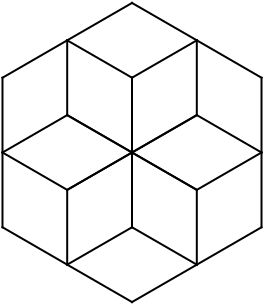

**FIGURA 30**
=============

El Tortugo y yo habíamos tenido una cena temprana y estábamos en el jardín acomodándonos para observar la noche. Había una pequeña y muy delgada masa de nubes cirrus en el sur, pero aparte de eso, el cielo estaba despejado. El último débil resplandor del crepúsculo se esfumaba en el oeste, y las estrellas eran rígidos puntos fríos de luz. 

"Parece que la vista va a ser buena ésta noche," dije. 

"Ciertamente," dijo el Tortugo, "no parece haber casi nada de centelleo."

"Sí... Y podemos ubicar bien a los planetas. Debríamos lograr una buena vista de Saturno ésta noche... Una buena vista y de los anillos en un aspecto excelente."

Por un rato simplemente nos quedamos mirando el cielo mientras la noche se hacía más profunda. Luego, el Tortugo retiró el protector de rocío de su pequeño reflector. 

"¿Qué piensas de la Ley de Bode?" preguntó, mientras ajustaba los círculos, "Estuve leyendo algo sobre eso hoy."

"Bastante inestable. No funciona para Neptuno y Plutón, y el índice tiene que estar manipuado por Mercurio. Igualemente, es una correlación interesante."

"¿No tienes también que asumir que los asteroides representan los vestigios del quinto planeta?"

"Sí. Bueno, eso no es exagerar las cosas. De hecho, probablemente puedas darla vuelta y usar la ley para predecir que debe haber habido un planeta a esa distancia del sol." 

"Suena como el producto de una imaginación fértil, para mí," dijo el Tortugo, dirigiendo el telescopio hacia Saturno. 

"Debería estar justo en tu órbita," dije, entrando a buscar una campera más abrigada.
    
