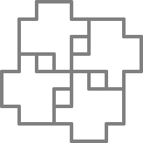

Figura 34
=========

Cuando volví de mi clase de Sánscrito, el Tortugo estaba instalado en la cocina revolviendo un menjunje repugnante que había metido en nuestro bowl de ponche. 

"¿Qué es esa asquerosidad?" pregunté amablemente, mientras me sacaba el abrigo y lo colgaba detrás de la puerta.

"Me sentí con ánimos de celebrar después de haber resuelto ese acertijo anónimo. Estoy preparando una variante de nuestro bowl tradicional de ponche," dijo el Tortugo, mientras sumergía una copa en el líquido y tomaba contemplativamente. 

"Se ve como desinfectante para ovejas, para mí," dije amablemente y alcanzando la copa. "¿Cómo crees que tomaremos todo eso antes de que fermente?" Tomé un traguito cauteloso... No estaba tan mal, en realidad. 

"Todo estará bien," dijo, "Tenemos la bendición de Soma."
 
