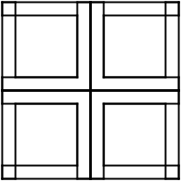

Figura 39
=========

Yo estaba trabajando en el estudio cuando entró el Tortugo con una sonrisa enigmática en la cara. Sin decir una palabra me dió una pequeña hoja de papel celeste. Había un grupo de letras escrito. 

    **YHWH**

Y estaba firmada, *'Del Que Vino Del Otro Lado Del Río'*. 

"¿YHWH? ¿Es de Módulo Ocho?" Pregunté. 

"No," dijo el Tortugo, "es mío." 

"¡Tuyo! ¿Qué es todo esto de venir del otro lado del río?"

"Oh, sólo estaba en el río en el comedor Good Old Dave buscando unas papas fritas y pescado," dijo, "Lo escribí mientras esperaba."

"Te debe haber dado mucho trabajo escribirlo," dije. El Tortugo sonrió. 

El aroma a papas fritas y pescado se filtraba desde el hall hasta el estudio. 

"Comamos," dije, dejando el papel en el escritorio y abriendo el camino hacia la cocina.

